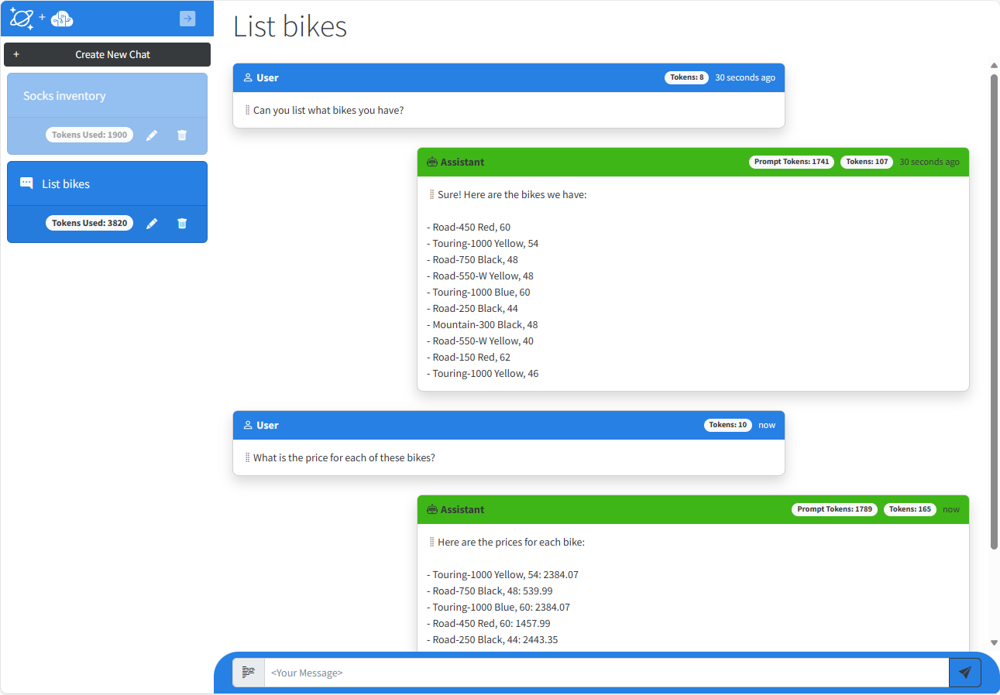

# Vector Search & AI Assistant for Azure Cosmos DB for MongoDB vCore

This solution demonstrates how to design and implement a **RAG Pattern** solution that incorporates Azure Cosmos DB for MongoDB vCore vector database capabilities with Azure OpenAI Service to build a vector search solution with an AI assistant user interface. The solution shows how to generate vectors on data stored in Azure Cosmos DB for MongoDB vCore using Azure OpenAI Service, then shows how to generate vectors from natural language user input which is then used in to perform a vector search using Azure Cosmos DB for MongoDB vCore. The vector query response payload is then passed to Azure OpenAI Service which generates responses back to the user. This solution includes additional key concepts such as managing conversational context and history, managing tokens consumed by Azure OpenAI Service, as well as understanding how to write prompts for large language models so they produce the desired responses.

The scenario for this sample centers around a consumer retail "Intelligent Agent" that allows users to ask questions on vectorized product, customer and sales order data stored in the database. The data in this solution is the [Cosmic Works](https://github.com/azurecosmosdb/cosmicworks) sample for Azure Cosmos DB. This data is an adapted subset of the Adventure Works 2017 dataset for a retail Bike Shop that sells bicycles, biking accessories, components and clothing.

## What is RAG?

RAG is an acronym for Retrieval Augmented Generation, a fancy term that essentially means retrieving additional data to provide to a large language model to use when generating a response (completion) to a user's natural language question (prompt). The data used in this type of application can be of any kind. However, there is a limit to how much data can be sent due to the limit of [tokens for each model](https://platform.openai.com/docs/models/overview) that can be consumed in a single request/response from Azure OpenAI Service. This solution will highlight these challenges and provide a simple example of how you can approach it.

## Solution User Experience

The application frontend is an ASP.NET Core Blazor Server application with a simple chatbot user interface:

The application includes a left-hand nav that contains individual chat sessions. In a normal retail environment, users would only be able to see their own session but we've included them all here. The chat session includes a count of all of the tokens consumed in each session. When the user types a question and hits enter the service vectorizes the user input then uses that in a vector query against the data stored in Azure Cosmos DB for MongoDB vCore. The results of the query are then passed to Azure OpenAI Service as part of the system prompt as well as some or all of the conversation history which is pre-prended to the user prompt. The generated response is then returned to the user. After the first question and response, the application calls a second "agent" which sends a request to the Azure OpenAI Service to summarize the topic of the conversation into a couple of words, then rename the chat session seen in the left-hand navigation. 

The chat session displays all of the tokens consumed for the length of that conversation. Each message in the chat also includes a token count. The `Prompt Tokens` are the tokens consumed by Azure OpenAI Service to process the request which includes some or all of the conversation history, the vector query payload and the user prompt. The `Tokens` represent the text for the User Prompt itself in the User message or the tokens used to generate the completion text in the Assistant message.

    

## Solution Architecture

The solution architecture is represented by this diagram:
This solution is composed of the following services:

1.  Azure Cosmos DB for MongoDB vCore - Stores the operational retail data and their vectors in three collections: products, customers and salesorders. It also stores all of the chat history in the completions collection.
1.	Azure OpenAI Service - Generates vectors using the Embeddings API on the `text-embedding-ada-002` model and chat completions using the Completion API on the `gpt-4-32k` model.

